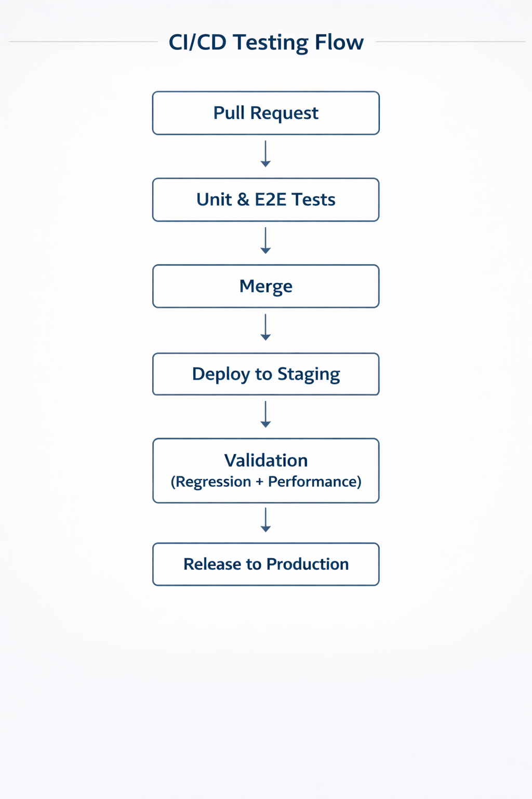

# QA Automation Portfolio

## 👋 About Me
I am a QA Engineer focused on quality-driven testing strategies, combining **manual testing**, **automation**, and **CI/CD validation** to ensure reliable and scalable software delivery.

I have hands-on experience working with modern testing tools and applying **risk-based testing** principles to prioritize critical user flows.

---

## 🧠 Testing Philosophy
I believe that quality is not about testing everything, but about **testing what matters most**.

My testing approach is based on:
- Risk-based testing
- Business impact analysis
- Early validation in CI/CD pipelines
- Continuous improvement

---

## 🔍 Risk-Based Testing Strategy

| Area | Risk Level | Impact | Testing Strategy |
|------|-----------|--------|------------------|
| Authentication | High | User access blocked | E2E + Regression |
| Payments / Wallet | Critical | Financial loss | E2E + API testing |
| Registration | Medium | Onboarding failure | Functional + Regression |
| Navigation | Medium | Broken user flow | Smoke testing |
| UI / Styling | Low | Visual issues | Exploratory testing |

---

## 🧪 Testing Types

### Manual Testing
- Functional testing  
- Regression testing  
- Smoke testing  
- Exploratory testing  
- UI / UX validation  

### Automation Testing
- Unit testing (Jest)
- End-to-End testing (Playwright)
- API testing
- Regression automation
- Smoke automation

---

## ⚙️ Tools & Technologies

- **Languages:** JavaScript, TypeScript , Python (scripting basics)
- **Automation:** Playwright, Jest  
- **API Testing:** Playwright API, Postman  
- **Performance Testing:** JMeter  
- **CI/CD:** GitHub Actions  
- **Project Management:** Jira  
- **Version Control:** Git / GitHub  

---

## 🔁 CI/CD Testing Flow

---

## 🎯 What I Focus On
My goal is to continuously improve testing strategies and contribute to high-quality software releases
- Preventing bugs before reaching production
- Ensuring critical business flows are protected
- Reducing manual testing through automation
- Improving release confidence

---

## 📌 Notes
All testing examples in this repository are performed using **demo and simulated environments** for learning and portfolio purposes.
---

## 📫 Contact
- GitHub: https://github.com/gtorrez-qa

